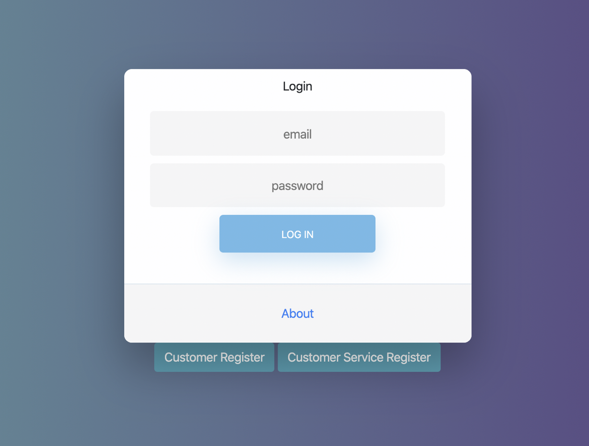
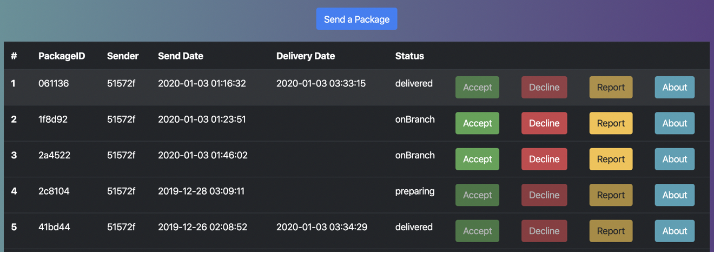
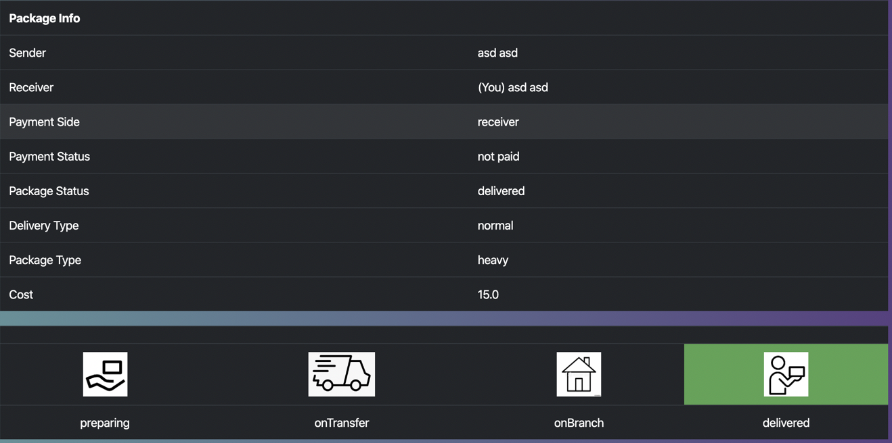

# shipit
A Spring-based shipping company website.

##### 1. Check out the repository

```bash
git clone https://github.com/musabgelisgen/shipit
```

##### 2. Change database configurations in application.properties
```bash
spring.datasource.url=<url-to-the-database>
spring.datasource.username=<mysql-database-username>
spring.datasource.password=<mysq-database-password>
```

##### 3. Run DataSourceGenerator configuration followed by ShipitApplication
Then visit http://localhost:8080

##### 4. User Manual

- Login page


- Users can see their package history


- & get further information on a particular package


- & also view their subscription panel to send packages for cheaper prices.


##### 5. Help me improve.

Feel free to make suggestions about the app through [issues](https://github.com/musabgelisgen/shipit/issues) section.

